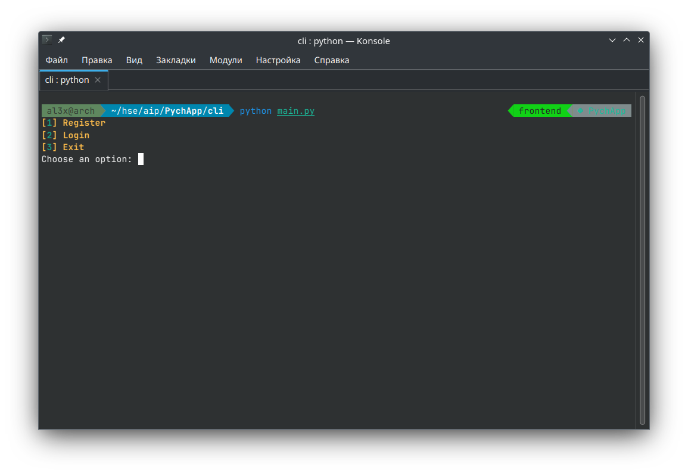
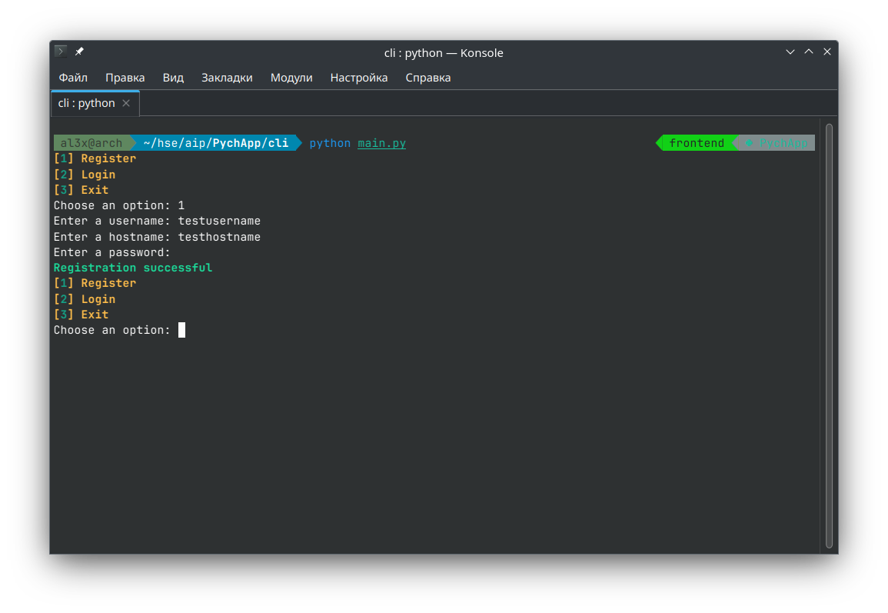
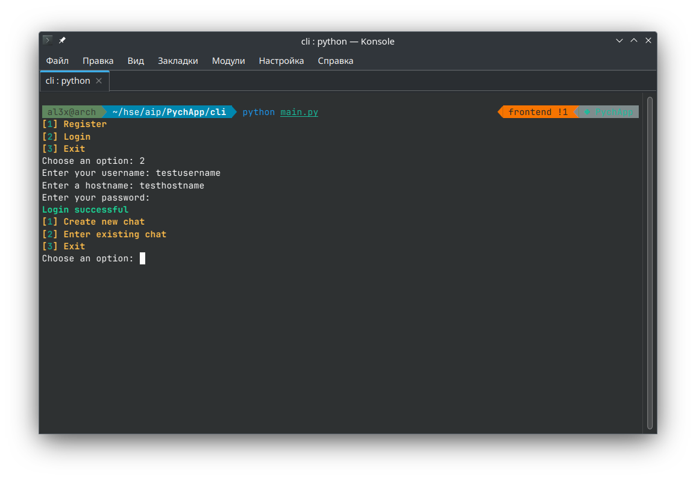
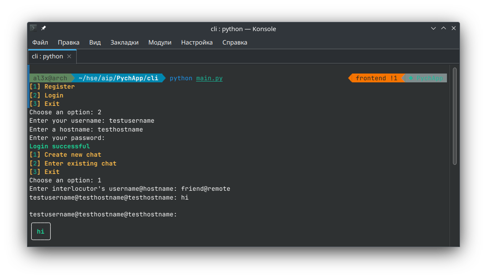
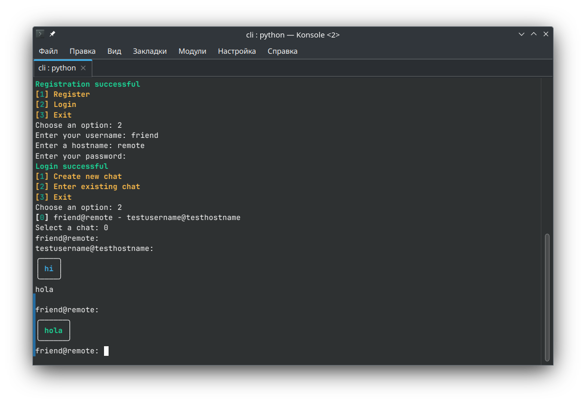

# User Manual for CLI Messenger Client

## Table of Contents

1. [Introduction](#introduction)
2. [Installation and Setup](#installation-and-setup)
3. [Starting the Application](#starting-the-application)
4. [Menu Navigation](#menu-navigation)
    - [Login Menu](#login-menu)
    - [Main Menu](#main-menu)
5. [Chat Functionality](#chat-functionality)
    - [Creating a New Chat](#creating-a-new-chat)
    - [Entering an Existing Chat](#entering-an-existing-chat)
6. [Encryption and Security](#encryption-and-security)
7. [Troubleshooting](#troubleshooting)
8. [FAQs](#faqs)

---

## Introduction

This manual guides users through the CLI Messenger Client, a command-line interface application designed for secure messaging. This tool allows users to create, manage, and participate in encrypted chat sessions.

---

## Installation and Setup

### Prerequisites

- Python 3.x
- SQLite3
- Internet Connection

### Installation Steps

1. **Clone the Repository:**
   Download the source code from the project repository.

2. **Install Dependencies:**
   Run `pip install -r requirements.txt` to install required Python packages.

3. **Configuration:**
   Edit the `config.toml` file to set server addresses and ports.

---

## Starting the Application

Run the application by executing `python main.py` in the terminal. This opens the main interface of the CLI Messenger Client.

Make shure to start the server first if you are using self-hosted version and server properties correctly placed in to the `config.toml`. See the `srv/` for more information.

---

## Menu Navigation

### Login Menu

Upon starting, the application presents three options:

1. **Register:** Create a new account.
2. **Login:** Log into an existing account.
3. **Exit:** Close the application.

### Registration

Follow the prompts to create a new account. Pay attention that application will not automatically log you in after successful registration.

### Main Menu

After successful login, the main menu offers:

1. **Create New Chat:** Start a new chat session.
2. **Enter Existing Chat:** Join a previously created chat.
3. **Exit:** Log out and return to the login menu.

---

## Chat Functionality

### Creating a New Chat

1. **Select 'Create new chat':** Enter the recipient's `username@hostname`.
2. **Chat Session:** If successful, a new chat session starts immediately.

### Entering an Existing Chat

1. **Select a Chat:** Choose from the list of existing chats.
2. **Chat Interface:** Engage in secure messaging with your contact.

---

## Encryption and Security

The application uses RSA and AES encryption for securing messages. Keys are generated and managed automatically, ensuring confidentiality and integrity.

---

## Troubleshooting

- **Connection Issues:** Verify your network connection and server settings in `config.toml`.
- **Login Problems:** Ensure correct username and password. Check server availability.

---

## FAQs

**Q: Can I use the application on multiple devices?**
A: Yes, but you need to transfer your user credentials securely.

**Q: Is my chat history stored securely?**
A: Yes, chat histories are stored locally in an encrypted SQLite database.
